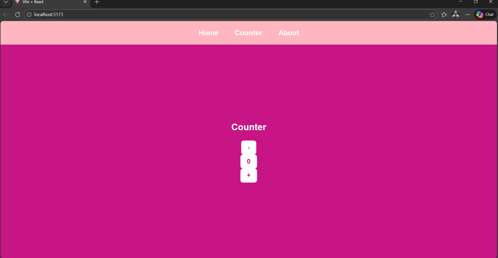
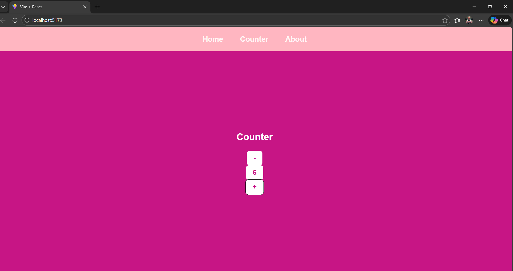
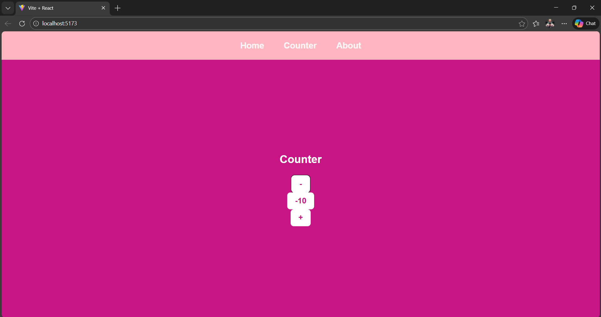

# React Counter App

A simple and elegant counter application built with React and Vite.

## Features

- ✨ Increment and decrement counter
- ⚡ Fast performance with Vite
- 🎨 Clean and responsive UI
- 📦 Lightweight and easy to use

## Screenshots

### Counter Interface


### Increment Action


### Decrement Action


## Project Structure

```
react-counter/
├── src/
│   ├── main.jsx
│   ├── App.jsx
│   └── App.css
├── index.html
├── package.json
├── vite.config.js
└── README.md
```

## Technologies Used

- **React** - JavaScript library for building user interfaces
- **Vite** - Next generation frontend tooling
- **JavaScript** - Programming language

## How It Works

The counter app allows users to:
- Click the increment button to increase the count
- Click the decrement button to decrease the count
- View the current count value in real-time

## Author
SIMHADRI VENKATA PADMAKAR


---

**Happy Coding!** 🚀
